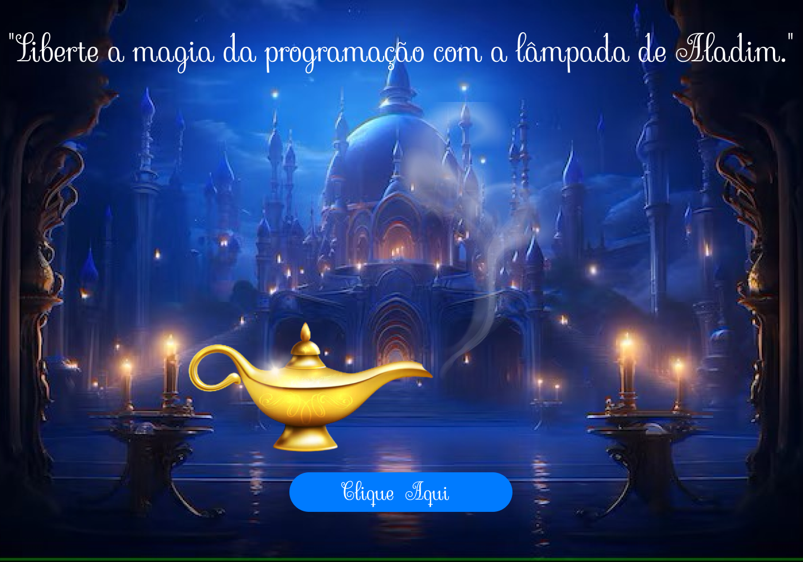

# Wishing Lamp Project
Project developed during the Full Stack Training of [@vainaweb](https://www.instagram.com/vainaweb/) to practice `React`.

## 🔥 Introduction
Website developed with the aim of putting into practice the knowledge acquired during training and learning how to use `useState`.

## 💻 Techs used

- Vite
- React
- React Hook
- SASS
- CSS FlexBox
- HTML

## 👷 Authors
- **Tatyane Gonçalves** - *Desenvolvedora* - [@tatyanepgoncalves](https://github.com/tatyanepgoncalves)
- **Equipe Vai na Web** - *Criador e educador técnico* - [@vainaweb](https://www.instagram.com/vainaweb/)

  

